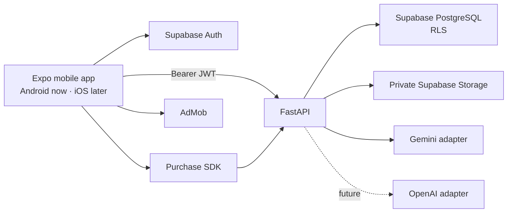

# CareerOS AI — Architecture Overview

## System



The Expo client owns UI, navigation and short-lived UI state. FastAPI owns trusted business rules, AI orchestration, usage limits and entitlement verification. Supabase owns identity, PostgreSQL, storage and row-level policy. No AI or service-role secret may enter the mobile binary.

## Mobile architecture

Use feature-first clean architecture:

```text
feature/
  domain/          entities, repository interfaces, pure use cases
  application/     hooks and view-model orchestration
  data/            API DTOs, repositories and mappers
  presentation/    screens, components and UI state
```

Routes only compose screens. Shared design-system components/tokens, network client, authentication, purchases, ads and analytics live outside feature folders. Use strict TypeScript and typed API contracts.

## Backend architecture

FastAPI modules use thin routers, schema models, services, repositories and provider integrations. Routers validate and authorize; services execute use cases; repositories persist; integrations isolate Supabase, Gemini, purchases and future OpenAI SDKs.

## Auth and data

- Supabase Auth supports anonymous guest, Google and email/password.
- Client sends Supabase access JWT to FastAPI; FastAPI verifies it and derives user identity server-side.
- Every user-owned record contains `user_id`; all tables require RLS and API ownership checks.
- Resume files are private; access uses short-lived signed URLs.
- Guest conversion is an acceptance-tested journey, not an afterthought.

Initial data: profiles, resumes, immutable resume versions, assessments, job descriptions, job matches, coach threads/messages, missions/completions, entitlements and metered usage events. All schema changes use append-only migrations.

## AI abstraction

Define a provider-neutral `CareerAiProvider`:

```text
assess_resume(input) -> ResumeAssessment
match_job(input) -> JobMatch
rewrite_content(input) -> RewriteSuggestion
coach_reply(input) -> CoachReply
```

Implement Gemini now; implement OpenAI later behind the same schemas. Prompts use minimal approved context, delimit untrusted content, prohibit fabrication, request structured output and validate it before persistence or display. Save prompt/model version and request IDs, never full private prompts in logs.

## Environments and delivery

Use isolated `dev`, `qa` and `prod` Supabase/API/secret/ad/purchase configuration, plus matching Expo app variants. Commit `.env.example` only. CI runs formatting, lint, type checks, unit/API tests and contract checks. Test core onboarding, account upgrade, ownership/RLS, assessment, match, accepted rewrite and entitlement flows.

## Security baseline

Validate inputs and uploads; use private storage; enforce RLS; use backend authorization and rate limits; redact PII/tokens/resumes from logs; scan dependencies/secrets; configure CORS; and document retention/deletion before public launch.
